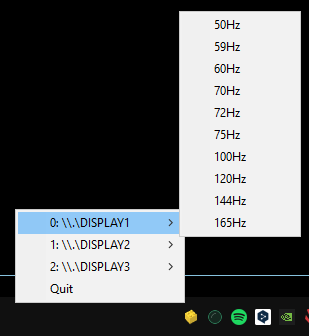

Switch refresh rates easily from your system tray




## Usage
(Python 3.11)
```
pip install -r requirements.txt

python main.py
```

Or just run the .exe found in **Releases**

## Startup

If you want to start the program on Windows startup:
- Create a shortcut of the exe
- `Win+R` -> `shell:startup`
- Place the shortcut in the Startup folder
